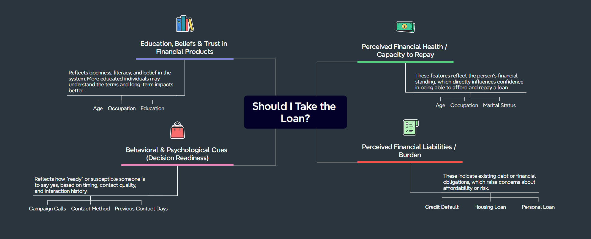

# **🏦 Term Deposit Subscription Prediction**

**🔱 AIAP Batch 20 Technical Assessment**


## 😀 Author

- Full Name: **Joel Ngiam Kee Yong**
- Email: joelngiam@yahoo.com.sg
- LinkedIn Profile: https://www.linkedin.com/in/joel-ngiam-kee-yong/
- Portfolio Website: https://personal-jnky.web.app/

## 🎯 1. Problem Statement

AI-Vive-Banking runs large-scale direct marketing campaigns - but these are costly and resource-intensive. Without intelligent targeting, many efforts go unrewarded. To improve outcomes, the bank needs a way to identify which clients are most likely to respond positively, so resources can be directed where they will matter most.

This project aims to:

- ✅ Build and evaluate **four** robust classification models to predict the client's subscription decision

- ✍️ Identify and explain **key features** influencing term deposit subscriptions

- 📈 Deliver **actionable insights** to optimize campaign effectiveness and resource use

By leveraging the data and predictive models, this project ultimately supports AI-Vive-Banking in **streamlining operations**, **boosting customer engagement**, and **maximizing financial returns**.

### **📦 1.1. The Data**

---

The dataset for this project was provided by the IT and Marketing departments of AI-Vive-Banking, containing historical data collected from previous direct marketing campaigns and enriched with client profile attributes. This real-world dataset forms the backbone of our analysis and modeling efforts.

It includes the following key feature groups:

**└── Client attributes** such as age, occupation, marital status, and education level

**└── Financial indicators** including credit default history, housing loan, and personal loan status

**└── Marketing campaign metrics** including the method of contact, prior engagement data, and the number of calls made during a campaign

This dataset offers a valuable opportunity to uncover patterns in customer behavior and gain insight into what drives a client to say "yes" to a term deposit - forming the foundation for predictive modeling and decision-making.

### **🧠 1.2. The Mind of our Customer**

---

Taking up a bank term loan is a deeply human decision, influenced by a complex interplay of perceived financial stability, personal values, existing financial obligations, and risk assessments. Unlike machine learning models that systematically analyze data across multiple dimensions, human decisions are often **non-linear**, **intuitive**, and **context-driven**, influenced by emotions, experiences, and personal beliefs rather than purely rational calculations.

- _"Do I believe this loan will help me?"_
- _"Can I afford to pay this back comfortably?"_
- _"Will this put me in a risky or unmanageable situation?"_

This is a preocess rooted in **bounded rationality**, where individuals simplify decisions into smaller, intuitive chunks using heuristics. People often will not perform detailed calculations but instead weigh broad categories like trust, affordability, or necessity. Rather than calculating exact returns or risks, people tend to rely on heuristics - mental shortcuts shaped by past experiences, education level, perceived risk, and belief in the financial system. These subjective evaluations often guide whether someone ultimately says “yes” or “no” to a loan offer.

The mindmap below is designed to reflect the thought process of a potential customer, helping us approach the problem from a more human-centric perspective. By understanding how clients think and what drives their decisions, we can build models that are not only accurate, but also aligned with real-world behavior.



└── **Disclaimer**: This mindmap is a conceptual representation intended to guide modeling and feature interpretation. It simplifies complex human decision-making processes and may not capture all real-world nuances or individual variations.

## 🌐 2. Project Overview

This project aims to predict the likelihood of clients subscribing to term deposits for AI-Vive-Banking using a **modular, configurable, and reproducible** machine learning pipeline. The goal is to help the bank refine its marketing strategies by identifying key client attributes and campaign factors that influence subscription decisions, enabling data-driven actions to optimize resource allocation and customer engagement.

The project includes:

- **Exploratory Data Analysis (EDA) 🔎📊🧩**: A deep dive into the dataset to uncover patterns and insights, laying the groundwork for feature engineering and model selection.

- **End-to-End Machine Learning Pipeline (ML Pipeline) 🏭🤖🔮**: A fully automated workflow that preprocesses data, trains multiple models, evaluates their performance, and generates actionable reports for strategic business decisions.

The pipeline is built to be **reusable, readable, and self-explanatory**, facilitating experimentation with various models, preprocessing techniques, and hyperparameters. This design ensures scalability, transparency, and ease of adaptation for future use cases or datasets.

### Folder Structure:

```
├── .github/               # Automates setup and execution for ML pipeline
├── archives/              # Folder for inactive files and logs
├── assets/                # Images or visualization assets
├── data/                  # Location for datasets; contents auto-generated
├── models/                # Saved trained models; contents are auto-generated
├── modules/               # Saved preprocessors and intermediary models; contents are auto-generated
├── output/                # Results of model evaluations; contents are auto-generated
├── src/                   # Python modules for the ML pipeline
│   └── utils/             # Utility functions for general EDA
│   └── pipeline.py        # Main executable for the pipeline
├── config.yaml            # Configuration file for the ML pipeline
├── eda.ipynb              # Exploratory Data Analysis (EDA) notebook
├── README.md              # This file
├── requirements.txt       # Dependencies for the project
└── reset.sh               # Bash script to reset the project
└── run.sh                 # Bash script to execute the entire ML pipeline
```

## 📋 3. Execution Instructions

1. This project requires **Python 3.12.0** for stable execution. Please ensure your environment uses this version. Install dependencies:

   ```bash
   pip install -r requirements.txt
   ```

2. [Optional] Manually download and place the dataset file into the `data/` folder. The following step does this automatically. Link for download: [https://techassessment.blob.core.windows.net/aiap20-assessment-data/bmarket.db](https://techassessment.blob.core.windows.net/aiap20-assessment-data/bmarket.db)

3. Run the ML pipeline by executing one of the following bash scripts:

   ```bash
   bash run.sh              # Run the full ML pipeline with all models.
   bash run.sh --lite       # Run the pipeline in lite mode, for quick debugging.
   bash run.sh --model lr   # Run a single model only (e.g. Logistic Regression). Options: [lr, rf, xgb, lgbm].
   ```

4. Experiment with the ML pipeline by modifying the `config.yaml` and `/src` files, then review the training logs in the `/archives` folder.

5. [Optional] Reset the project:

   ```bash
   bash reset.sh
   ```

## 🔎 4. EDA Workflow & Findings

The Exploratory Data Analysis (EDA) process is designed to systematically understand the dataset, identify patterns, and inform subsequent steps such as feature engineering and model selection in the ML pipeline. Instead of isolating univariate, bivariate, and multivariate analyses into separate sections, the EDA workflow is integrated into broader, purpose-driven stages that reflect the iterative nature of data exploration. Below is a visual representation that illustrates the key stages of the EDA workflow:

<div style="margin-bottom: 20px;">
    
</div>

For a detailed walkthrough of the EDA and its workflow, please refer to the `eda.ipynb` notebook.

Below is a brief summary of the most significant insights and key findings from the EDA:

### **🔎 4.1. Target Variable: `Subscription Status`**

- **Class Distribution**: The target variable is **highly imbalanced**, with 88.73% of clients not subscribing and 11.27% subscribing. This **11.27%** conversion rate serves as the benchmark for our models, particularly in terms of `Precision`. We aim to improve resource allocation, ensuring that efforts are directed towards clients who are more likely to subscribe, while minimizing wasted resources on false positives.

- **Metric Selection**: Class imbalance can cause models to favor the majority class, resulting in poor recall for the minority class. In this case, identifying potential subscribers is crucial, so minimizing false negatives was a priority. To better assess model performance, **alternative metrics** like `Precision`, `Recall`, `F1-Score`, and `ROC-AUC` were prioritized over `Accuracy` to focus on correctly predicting subscribers.

- **Data Splitting Strategy**: A `stratified train-test split` was used to **preserve the class distribution** in both training and validation sets, ensuring reliable evaluation.

- **Mitigation Techniques**: Techniques like `SMOTE` and `SMOTE-ENN` for oversampling and class weighting in models were applied to **reduce bias** toward the majority class and improve performance on the minority class. Given that this dataset was adapted from the Portuguese bank marketing dataset (Moro, S., Rita, P., & Cortez, P., 2014) and noted in the assessment to contain synthetic or contaminated data, we expect significant noise. Therefore, SMOTE-ENN was used to both generate synthetic samples and clean noisy instances, improving model performance.

### **🔎 4.2. Feature Engineering & Transformation**

- **Identifiers**:

  - The `Client ID` was removed as it had no predictive value.

- **Demographics**:

  - The `age` feature was cleaned by removing inconsistent formats (e.g., "57 years") and converting values to numeric. Outliers such as age 150, assumed to be missing at random, were imputed using the median of valid entries.

  - A new categorical feature, `age_category`, was created by binning ages into meaningful groups (15-19, 20-60, 60+) to reveal age-related subscription trends.

  - For `marital_status` and `education_level`, rows with unknown values were removed to maintain data integrity.

  - A binary feature, `is_married`, was derived from marital status to reflect relationship status, and `education_level` was grouped into a new `education_group` feature (low, medium, high) to enhance model interpretability while preserving the educational gradient.

  - Additionally, a `financial_stability` feature was engineered by categorizing `occupation` based on assumed income levels.

- **Financial Health Indicators**:

  - For `housing_loan`, missing values (comprising 60% of the data) were retained as a separate category, while unknown values were treated as "No" due to their similar observed impact on subscription behavior (see EDA for details).

  - In contrast, for `credit_default`, unknown values were preserved as a distinct category, as the lack of disclosure may reflect financial discomfort or stigma.

  - For `personal_loan`, unknown values were imputed as "No" using the same logic as housing_loan, and missing values were imputed using `K-Modes`.

  - A new binary feature, `has_loan`, was created by combining housing_loan and personal_loan to capture overall loan exposure.

  - Clustering on financial health indicators using `KModes` was explored, but the resulting clusters primarily reflected high-frequency combinations, offering limited added insight and was thus not included.

- **Campaign Engagement**:

  - To simplify and enhance interpretability of the `contact_method` feature (which includes only two categories), a binary variable `is_contact_method_cellular` was introduced.

  - The `campaign_calls` feature, which was highly skewed, was capped at 11 to mitigate the influence of outliers and reduce noise.

  - Additionally, the feature `contacted_multiple_times` was engineered to indicate whether a client had received more than one contact attempt during the campaign, providing a clearer signal of engagement intensity.

  - To handle the 999 placeholder in `previous_contact_days` (indicating no prior contact), the feature was binned into meaningful categories, and a new binary feature, `has_prior_contact`, was created to explicitly flag prior interactions.

### **🔎 4.3. Feature Analysis & Relationships:**

- **Demographics**:

  - Younger (15-19) and older (60+) clients showed higher subscription rates, while the middle-aged group (20-60) had lower conversion. Continuous `age` was a stronger predictor than binned age categories. The engineered `age_category` feature provided interpretability but was less predictive than continuous age.

  - Clients with no declared `occupation` had the highest conversion rate, revealing a non-linear pattern. The engineered `financial_stability` feature (grouping occupations into none, low, medium, high) highlighted unexpected patterns in conversion rates, with the "none" category showing the highest subscription rate. Specific occupation categories like `occupation_entrepreneur` and `occupation_blue-collar` had varying predictive value across models.

  - The engineered `is_married` feature created from `marital_status` showed that single/divorced clients had a higher subscription rate than married clients. The binary grouping proved useful, with moderate influence in tree models using Recursive Feature Elimination and Permutation Importance.

  - Grouping `education_level` into `education_group` (low, medium, high) helped reduce noise and revealed subtle differences in subscription rates, with low education showing the lowest conversion rate. The engineered education grouping maintained moderate to high predictive value, especially in tree-based models.

  - K-Prototypes clustering was used on demographic features to create the `demographic_cluster` feature, which showed varying levels of predictive power based on feature selection methods, suggesting some value in combining demographic characteristics for modeling.

- **Financial Health**:

  - The `credit_default` feature showed minimal predictive power due to its extreme imbalance (only 0.01% labeled as "yes"). Clients with an unknown status had a lower conversion rate. Despite its limited predictive strength, the engineered feature indicated a slight correlation with lower subscription rates for unknown statuses.

  - The `personal_loan` and `housing_loan` features had significant missing values and imbalances, with `personal loans` showing a high proportion of "no" responses. Both features showed similar subscription distributions but weak predictive power when analyzed independently.

  - The creation of the `has_loan` feature, which combines personal and housing loans, indicated moderate predictive power, particularly in tree models. This feature helped capture the presence of any loan, showing a stronger signal than individual loan features.

- **Campaign Engagement**:

  - Clients contacted via cellular (`is_contact_method_cellular`) had significantly higher subscription rates (14.7%) than those contacted by telephone (5.3%). This engineered feature was a strong predictor across models, ranking high in RandomForest Permutation Importance and moderate in Mutual Information, confirming the influence of contact medium.

  - The presence of any prior contact (`has_prior_contact_yes`) strongly correlated with higher conversion, while `previous_contact_days_no-contact` (999 placeholder) indicated lower subscription rates. Both features showed high predictive power, while the binned `previous_contact_days` (recent, moderate, long) had limited added value.

  - Although heavily skewed, the numeric feature `campaign_calls`, even after capping, was consistently one of the top predictors. The engineered binary `contacted_multiple_times` revealed that clients contacted only once had higher subscription (13.1%) than those contacted multiple times (9.9%), suggesting diminishing returns from repeated outreach. It showed moderate to high predictive power in RF-based methods.

- **Low-Impact Features**:

  - Features consistently showing minimal predictive power across Mutual Information, Logistic Regression RFE/PI, and RandomForest RFE/PI included all age categories (`age_category_young`, `age_category_middle-age`, `age_category_elderly`), low-frequency education levels (`education_level_illiterate`, `education_level_basic-6y`, `education_level_unknown`), and niche occupations (`occupation_housemaid`, `occupation_student`, `occupation_unemployed`, `occupation_self-employed`, `occupation_entrepreneur`).

  - Certain financial indicators like `credit_default_yes` and `has_loan_no`, as well as some temporal engagement features (`previous_contact_days`, `has_prior_contact` in RF PI), also ranked consistently low.

  - These features were flagged as candidates for removal or dimensionality reduction due to their weak contribution to predictive performance and risk of adding noise to the model.

### **🔎 4.4. Actionable Insights**

- **🎯 Targeted Campaigning**: Focus marketing efforts on clients who were previously contacted (`has_prior_contact_yes`) and those reachable via cellular (`is_contact_method_cellular`), as they have significantly higher subscription rates. Leverage this insight to design segmented campaigns based on preferred contact channels and prior engagement status.

- **📱 Optimize Contact Strategy**: Avoid over-contacting clients. Those contacted once (`contacted_multiple_times = no`) show higher conversion (13.1%) than those contacted multiple times (9.9%). Prioritize quality over quantity by refining call scripts and timing, especially for first contacts.

- **👥 Demographic-Driven Messaging**: Customize outreach messages for age groups: target younger (15–19) and older (60+) clients more aggressively, as they show higher conversion. Adjust messaging for middle-aged clients, who are less responsive. Tailor content based on marital and education groupings (e.g. `is_married`, `education_group`) for resonance.

- **💵 Financial Profiling**: Use the engineered `has_loan` feature to assess financial stress. Clients without loans tend to have higher conversion potential. Position term deposits as secure financial growth for low-risk profiles. Avoid focusing on those with credit defaults, which shows very limited engagement.

- **🤖 Modelling Considerations**: Retain high-impact features like continuous `age`, `is_contact_method_cellular`, `campaign_calls`, `has_prior_contact`, and `has_loan` for predictive modelling. Drop or consolidate low-signal features like `age_category`, rare `occupations`, and sparse `education_level` to reduce noise and improve generalization.

- **🏹 Strategic Resource Allocation**: Combine model output with marketing cost metrics to build a lead scoring system. Direct high-effort marketing only toward top-ranked leads to maximize ROI, reduce churn, and improve campaign efficiency.

These EDA findings provide a strategic edge by aligning data-driven insights with marketing execution. By focusing on high-impact features and streamlining low-value inputs, we can enhance model performance while guiding smarter outreach to **target the right clients, at the right time, with the right message**. A feedback loop between modeling and marketing will amplify results, driving precision, efficiency, and ROI.

## 🏭 5. Pipeline Design

The machine learning pipeline employs a **sequential processing** methodology, where tasks are executed in a linear order, with each stage depending on the output of the previous one. This approach ensures a straightforward and predictable workflow, making the pipeline intuitive to follow and easier to debug. By completing one task before moving to the next, we maintain a clear and logical progression throughout the pipeline.

Given the relatively small size of the dataset, sequential processing is sufficient and computationally efficient. However, for larger-scale projects or big data applications, **parallel processing** could be considered to optimize resource utilization and reduce execution time. While parallel processing offers performance benefits, it introduces additional complexity, requiring careful orchestration to manage data dependencies effectively.

Below is a illustrative representation of the steps in the pipeline:

<div style="margin-bottom: 20px;">
    
</div>

The machine learning pipeline is designed to be **modular**, **interpretable**, and **scalable**, enabling easy experimentation with different models, preprocessing steps, and hyperparameters. Below is a detailed breakdown of the logical steps involved in the pipeline:

### **5.1. 📥 Data Loading:**

- **Load Data**: Retrieve the dataset from `data/bmarket.db` using SQLite and convert to a Pandas DataFrame.
- **Validation**: Ensure the database path is correct and the required table exists to prevent errors.
- **Automation**: Automate data retrieval for a self-contained, executable pipeline without manual intervention.

### **5.2. 🧼 Data Cleaning:**

- **Data Integrity**: Checked for duplicates and resolved inconsistencies to ensure clean data.
- **Feature Removal**: Dropped irrelevant features that do not influence subscription prediction.
- **Standardization**: Standardized column data types for compatibility and efficiency in preprocessing.
- **Categorical Optimization**: Converted categorical columns to `category` dtype to optimize memory usage.
- **Missing Values**: Imputed missing values with placeholders, to be addressed using training data during later preprocessing.
- **Systemic Issue Resolution**: Identified and resolved data quality issues, providing feedback to the operations team for continuous improvement.

### **5.3. 🔧 Data Preprocessing:**

- **Stratified Train-Test Split**: Use an 80%-20% split to preserve class distribution and ensure balanced training and testing sets for model evaluation.
- **Advanced Cleaning**: Impute missing values, remove outliers, and address inconsistencies based on insights from the training set during EDA (e.g., handling unknown values for key features).
- **Feature Engineering**: Create new features (e.g., financial stability, demographic clusters) and transform existing ones to improve model interpretability and predictive power.
- **Feature Transformation**: Normalize numerical features with standard scaling and encode categorical variables using One-Hot and Ordinal Encoding, as resampling techniques like SMOTE and SMOTE-ENN require encoded data.
- **Manual Feature Selection**: Remove features with low variance or high noise identified during EDA to ensure stable, interpretable models.
- **Separation of Preprocessing and Modeling**: Keep preprocessing and model training separate to simplify debugging and ensure flexibility in swapping components (e.g., scalers, encoders).
- **Data Integrity**: Regularly check the dataset’s shape and consistency throughout preprocessing to maintain data quality.

### **5.4. 🤖 Model Training:**

- **Train Models**: Train multiple models to identify the best-performing one for subscription prediction.
- **Cross-Validation**: Utilize cross-validation during training to enhance robustness, minimize overfitting, and ensure the model's stability across different subsets of data.
- **Hyperparameter Tuning**: Use `GridSearchCV` or `RandomizedSearchCV` for hyperparameter tuning. The latter is preferred for faster exploration, while the former is used for fine-tuning after narrowing down parameters.
- **Pipeline**: Apply `SMOTE` / `SMOTE-ENN` for handling class imbalance and integrate it into the model training pipeline.
- **Save Models**: Save the best-performing models along with their training time and file size for comparison and future use.

### **5.5. 📊 Model Evaluation:**

- **Assess Model Generalization**: Evaluate models on the test set to simulate their performance on unseen data, ensuring they generalize well and are not overfitted to the training set.
- **Comprehensive Metrics**: Use a combination of performance metrics such as accuracy, precision, recall, F1-score, ROC AUC, and PR AUC to assess the model from multiple angles.
- **Visualization Tools**: Generate and save visualizations such as ROC and Precision-Recall curves, confusion matrices, learning curves, and calibration curves. These visual aids provide deeper insights into model behavior and performance.
- **Feature Importance**: Analyze and visualize feature importance to identify key predictors and better understand model decisions.
- **Save Results**: Store evaluation results and visualizations in a dedicated output directory for easy access and comparison, ensuring reproducibility of the evaluation process.

### └── Optimization Note:

- To optimize computational efficiency, the pipeline will bypass the data cleaning steps if the cleaned dataset (`cleaned_data.csv`) already exists.
- This approach eliminates redundant processing when there are no changes to the raw dataset or the cleaning logic, conserving time and computational resources.
- If any modifications are made to the data cleaning steps, ensure you reset the project and rerun the pipeline to regenerate the datasets.
- This guarantees consistency across runs and prevents the use of outdated or mismatched data in subsequent stages of the pipeline.

## 🛠️ 6. Feature Processing

The following table summarizes how each feature in the dataset was processed to prepare it for machine learning modeling. These transformations aim to improve model performance, ensure compatibility with algorithms, and reduce noise while preserving meaningful patterns in the data.

For a detailed explanation of each feature's processing and rationale, please refer to the `eda.ipynb` notebook.

| Category    | Feature                        | Source | Processing                                                       |
| ----------- | ------------------------------ | ------ | ---------------------------------------------------------------- |
| Identifiers | `Client ID`                    | 🌱     | ❌ Dropped due to low predictive value                           |
| Target      | `Subscription Status` ⭐       | 🌱     | Converted to binary                                              |
| Categorical | `Occupation`                   | 🌱     | Standardized text, dropped unknowns                              |
|             | `Marital Status`               | 🌱     | Dropped unknowns                                                 |
|             | `Education Level`              | 🌱     | Standardized text                                                |
|             | `Credit Default`               | 🌱     | Retained unknowns as separate category based on domain knowledge |
|             | `Housing Loan`                 | 🌱     | Imputed unknowns as 'no'; missing kept as separate category      |
|             | `Personal Loan`                | 🌱     | Imputed unknowns as 'no'; missing filled using `K-Modes`         |
|             | `Contact Method`               | 🌱     | Standardized text                                                |
|             | `Previous Contact Days`        | 🌱     | Binned and converted to categorical                              |
|             | `Age Category`                 | 🛠️     | Binned from `Age` based on subscription patterns                 |
|             | `Is Married`                   | 🛠️     | Binary flag created from `Marital Status` (only 'married' = yes) |
|             | `Education Group`              | 🛠️     | Consolidated levels from `Education Level`                       |
|             | `Financial Stability`          | 🛠️     | Grouped categories from `Occupation`                             |
|             | `Demographic Cluster`          | 🛠️     | Clustered using `K-Prototypes` on demographic features           |
|             | `Has Loan`                     | 🛠️     | Combined `Housing Loan` and `Personal` Loan into one binary flag |
|             | `Is Contacted Method Cellular` | 🛠️     | Binary flag for cellular `Contact Method`                        |
|             | `Contacted Multiple Times`     | 🛠️     | Binary flag for `Campaign Calls` > 1                             |
|             | `Has Prior Contact`            | 🛠️     | Binary flag based on `Previous Contact Days`                     |
| Numerical   | `Age`                          | 🌱     | Removed text, converted to int, dropped erroneous values         |
|             | `Campaign Calls`               | 🌱     | Used absolute values; capped outliers                            |

**└── Summary:**

A total of 21 features were processed - 12 original features cleaned or transformed, 8 new features engineered for better signal extraction, and 1 feature dropped due to low predictive value. The final dataset consists of 1 target and 19 usable features.

**└── Legend / Notes:**

- ⭐: Target variable
- 🌱: Original feature
- 🛠️: Engineered feature
- ❌: Dropped feature
- The 'Categorical' / 'Numerical' columns reflects the final data type of each feature after processing, not its original form.

## 🤖 7. Candidate Models

### **✒️ 7.1. Selection Criteria**:

---

The choice of machine learning models for predicting client subscriptions was driven by the following key factors:

- **Binary Classification:** The target variable (`Subscription Status`) is binary, making classification algorithms such as Logistic Regression, Random Forest, XGBoost, and LightGBM ideal choices. These models are well-suited to handle binary outcomes effectively.

- **Structured/Tabular Data:** The dataset consists of structured tabular data, where tree-based models such as XGBoost, Random Forest, and LightGBM are well-suited due to their strength in capturing complex patterns and modeling non-linear relationships.

- **Scalability:** With approximately 40,000 records, scalability remains an important factor. XGBoost and LightGBM are optimized for large datasets and can efficiently manage the high dimensionality of the data, maintaining performance without substantial increases in computational cost.

- **Interpretability:** While model performance is the main focus, interpretability is also a priority to ensure that the bank can derive actionable insights from the model's predictions. Tree-based models offer clear feature importance scores, enabling transparency in the decision-making process and fostering trust in the results.

- **Human-Like Decision-Making:** Tree-based models mimic human decision-making by using step-by-step if-then rules, similar to how people consider factors like "Do I need this?" or "Can I repay this?" when deciding whether to take up a bank term loan. These models evaluate features in a sequence of logical splits, which aligns with human reasoning based on need, ability to repay, and other relevant factors. This approach makes tree-based models intuitive, interpretable, and closely aligned with real-world decision-making.

### **🤖 7.2. Selected Models**:

---

#### **✅ `Logistic Regression`**

- Logistic Regression was chosen for its simplicity, interpretability, and efficiency in binary classification tasks, making it an ideal starting point for modeling our problem.
- As a linear model, it scales well with large datasets and provides a computationally efficient solution, allowing for faster training compared to more complex algorithms. It also serves as a solid baseline for evaluating the performance of more advanced models.
- One of the key advantages of Logistic Regression is its transparency, as the feature importance can be easily derived from the model coefficients. This provides clear insights into the influence of each feature on the target variable, aiding in model interpretation.
- While Logistic Regression performs well for linearly separable data, it may struggle with more complex, non-linear relationships. Nonetheless, its simplicity and efficiency make it an excellent tool for quickly understanding the problem and setting a benchmark for other models.

#### **✅ `Random Forest`**

- Random Forest was selected for its ability to capture complex, non-linear relationships and interactions in the data by building multiple decision trees and aggregating their predictions.
- The ensemble nature of Random Forest, combined with bagging (bootstrap aggregating) and random feature selection, helps improve generalization, making the model robust to overfitting even with noisy or high-dimensional data.
- Random Forest works seamlessly with both numerical and categorical features, making it versatile for various datasets. It also provides valuable feature importance scores, which help identify the most impactful predictors in the model.
- However, Random Forest's training time can become computationally expensive, particularly with large datasets or deep trees. It also tends to be less interpretable than simpler models like Logistic Regression due to the complexity of aggregating multiple trees.
- Despite these limitations, Random Forest offers a strong balance of predictive power, interpretability through feature importance, and robustness, making it a solid choice for handling complex datasets with minimal hyperparameter tuning.

#### **✅ `XGBoost`**

- XGBoost was selected for its ability to efficiently handle structured/tabular data, making it ideal for our dataset of ~40,000 records with 40+ features.
- The algorithm builds trees sequentially, improving upon the errors of previous trees, which allows it to capture complex patterns and interactions in the data. This boosts both predictive performance and model robustness.
- XGBoost’s support for regularization (L1/L2 penalties) is crucial in preventing overfitting, particularly after applying SMOTE-ENN to rebalance the data. Its optimized implementation allows for faster training compared to Random Forest, even with large datasets.
- Additionally, XGBoost performs well with imbalanced datasets and provides valuable insights through feature importance metrics and SHAP values, which enhance model interpretability.
- However, while it excels at scalability, XGBoost can be slightly less interpretable than simpler models like Logistic Regression. Nonetheless, after careful hyperparameter tuning, XGBoost provided a great balance of speed, scalability, and accuracy, making it a strong choice for our model.

#### **✅ `LightGBM`**

- LightGBM was chosen for its ability to handle large datasets with many features efficiently. Its histogram-based algorithm and leaf-wise growth enable faster training and high predictive performance, making it well-suited for our ~40,000 record dataset with 40+ scaled features.
- It also incorporates techniques like Gradient-based One-Side Sampling (GOSS) and Exclusive Feature Bundling (EFB), which improve speed and memory usage.
- Built-in regularization helped control overfitting, especially important after applying SMOTE-ENN.
- Additionally, LightGBM provides feature importance metrics, supporting model interpretability.
- That said, its leaf-wise splitting can overfit on noisy or synthetic data, requiring careful hyperparameter tuning. Despite this, LightGBM offered the best balance of speed, scalability, and accuracy for our needs.

### **❓ 7.3. Why not other models?**:

---

#### **❌ `CatBoost`**

- While CatBoost's key strength lies in its ability to handle categorical variables internally, the benefits of this feature were somewhat diminished by our preprocessing approach.
- Since we already apply one-hot encoding for categorical variables as part of the SMOTE and SMOTE-ENN resampling techniques, we lose the unique advantage that CatBoost offers in automatically handling categorical data.
- Additionally, since we are already using resampling techniques, other tree-based models like XGBoost and LightGBM, which do not rely on internal categorical handling, were prioritized for their flexibility, speed, and scalability. These models, combined with our preprocessing steps, allowed us to achieve better performance with more control over the hyperparameters and overall model complexity.
- Nonetheless, CatBoost is still a powerful algorithm for handling categorical data directly and is worth considering in different scenarios where feature encoding is minimal or when computational efficiency is less of a concern.

#### **❌ `Neural Networks`**

- Neural networks are better suited for unstructured data types like images, text, or audio, where deep hierarchical representations are beneficial. Our dataset, however, consists of structured/tabular data with engineered features, which aligns more naturally with tree-based methods.
- While neural networks can model complex non-linear patterns, models like XGBoost and LightGBM already capture such relationships effectively in tabular data, often with faster training times and lower risk of overfitting.
- Neural networks also require more tuning (e.g., architecture design, learning rates, regularization strategies), greater computational power, and longer training times, which may not justify the marginal performance gains, if any, in this setting.
- In our case, tree-based models not only outperform neural networks in both speed and predictive accuracy but also offer superior interpretability through tools like SHAP. Hence, neural networks are neither necessary nor optimal for this problem.

#### **❌ `Support Vector Machines (SVM)`**

- SVMs are known for their high computational expense, especially for moderately large datasets like ours (40,000+ records).
- While they perform well with smaller datasets and clear decision boundaries, they do not scale efficiently for larger datasets, making them less practical in this scenario.
- We initially tried using SVC with RBF (Radial Basis Function) and polynomial kernels to capture non-linear relationships and interactions within the data. However, the training process took an exceptionally long time, making it impractical to use within our current time and resource constraints.
- If we had more training time and additional computational resources, we could revisit this approach, as the SVC with these kernels could potentially offer valuable insights. But for now, we have chosen to exclude it from our model selection.

#### **❌ `K-Nearest Neighbors (KNN)`**

- KNN suffers from the "curse of dimensionality", where performance degrades as the number of features increases. This issue becomes particularly significant when working with high-dimensional datasets after encoding like ours.
- KNN is both memory and computationally expensive during both training and prediction. KNN requires storing all the training data during prediction, which leads to increased memory usage as the dataset size grows. For moderately large datasets (40,000+ records), the time needed to calculate the distance between each test point and all training points grows exponentially, making the model slow and inefficient.
- Similar to the limitations of SVMs, as mentioned earlier, KNN also struggles with scalability on large datasets. Given the computational constraints and the time-intensive nature of KNN, it is not an ideal choice for this task.

### **🗒️ 7.4. Model Selection Summary**:

---

- In summary, Logistic Regression serves as a baseline model to establish a performance benchmark, while Random Forest, XGBoost, and LightGBM are chosen for their ability to handle complex relationships and large datasets efficiently.

- Models like XGBoost and LightGBM are prioritized for their scalability and optimization for large datasets, ensuring computational efficiency without compromising performance.

- While advanced models like XGBoost and LightGBM provide excellent predictive performance, interpretability is maintained through feature importance scores values, allowing for a deeper understanding of the factors driving predictions.

## 📊 8. Model Evaluation

The evaluation of machine learning models in this project is tailored to address the business goal of predicting client subscription to term deposits while tackling the challenges posed by an imbalanced dataset. Our chosen metrics and visualizations are designed to provide actionable insights that align with the bank’s marketing objectives, balancing interpretability, fairness, and robustness.

### 🧪 8.1. Key Metrics and Justifications:

---

**└── ✅ Recall Optimization with Minimum Acceptable Precision**:

- By prioritizing recall, we ensure that the model captures as many potential subscribers as possible, aligning with the bank’s objective of optimizing marketing strategies and improving resource allocation. This ultimately drives higher subscription rates and revenue.

- **Minimizing False Negatives**: False negatives (missing potential subscribers) carry a high opportunity cost, as they result in lost income and missed revenue. Capturing these leads is critical to maximizing the bank's marketing effectiveness and achieving its business goals.

- To balance recall with actionable predictions, we maintain a minimum precision threshold of 20%, ensuring that marketing efforts achieve a significantly higher conversion rate than the baseline (11.12%). This ensures our targeting is better than random outreach and provides a clear benchmark for success.

- **Managing False Positives**: False positives (contacting non-subscribers) are relatively low-cost, requiring minimal effort (e.g., a call). This enables a balance between **_exploitation_** (e.g., targeting high-probability leads) and **_exploration_** (e.g., investigating uncertain leads to uncover hidden opportunities). Tolerating some false positives allows us to gather valuable customer behavior insights, refine marketing strategies, and identify cross-selling opportunities while building long-term relationships and improving customer lifetime value. Additionally, this exploration helps mitigate potential data biases (e.g., age, occupation), ensuring fair representation and avoiding skewed predictions that could disadvantage specific client groups.

**└── ❌ Accuracy**

- Not used due to the highly imbalanced nature of the dataset. A model predicting all negatives would achieve misleadingly high accuracy, providing no actionable value.

**└── ❌ F1 Score / F-beta Score / PR-AUC / ROC-AUC**

- While the F1 score is a logical choice for balancing precision and recall, preliminary results on the cleaned dataset (before feature engineering) showed undesirably low scores (~30%) due to subpar precision and recall. Given the precision-recall tradeoff, unsuccessful preliminary feature engineering attempts to significantly improve performance, and **partial marketing campaign information granted by the IT and marketing teams**, we prioritized precision and recall directly to align with business goals given the time constraints of this assessment. Although feature engineering could potentially enhance model performance, we prioritized other metrics to address key objectives more effectively within the available resources.

- The F-beta score, which allows weighting recall over precision, does not enforce a minimum precision threshold. This makes it less suitable for our context, where maintaining a precision of at least above the baseline conversion rate (i.e. 11.12%) is critical to ensure efficient resource allocation.

- Similarly, PR-AUC and ROC-AUC are valuable for summarizing model performance across all thresholds, but they serve different purposes. PR-AUC focuses on the trade-off between precision and recall, while ROC-AUC evaluates the trade-off between True Positive Rate and False Positive Rate. However, neither metric enforces a specific precision requirement, making them less actionable for our needs compared to setting an explicit precision threshold.

- Nonetheless, we still utilize these metrics (F1 score, F-beta score, PR-AUC, and ROC-AUC) as supplementary tools to evaluate the model's overall ability to balance precision and recall, particularly for the minority class, providing valuable context for comparing models and analyzing performance trends across varying thresholds.

### 📈 8.2. Key Visualizations and Justifications:

---

**└── Performance Evaluations Visualizations**:

- To assess the overall effectiveness of the models, several visualizations were created to illustrate their ability to distinguish between classes and balance precision and recall.

- **✅ ROC Curves**: These curves visualize the trade-off between the True Positive Rate (TPR) and False Positive Rate (FPR) across different probability thresholds. They complement the ROC-AUC metric by offering a clear depiction of how well the model discriminates between "Subscription" and "No Subscription."

- **✅ Precision-Recall Curves**: Focused on the minority class ("Subscription"), these curves highlight the balance between precision and recall. They are particularly valuable in imbalanced datasets, as they emphasize the model's ability to capture potential subscribers while maintaining acceptable precision levels.

**└── Diagnostic Visualizations**:

- To diagnose potential issues and identify areas for improvement, additional visualizations were generated:

- **✅ Confusion Matrices**: These matrices provide a granular breakdown of predictions, showing the counts of True Positives (TP), True Negatives (TN), False Positives (FP), and False Negatives (FN). Normalized confusion matrices are also plotted to facilitate interpretation, especially when comparing models with varying class distributions. These visualizations help pinpoint whether the model struggles more with false positives or false negatives, enabling targeted improvements.

- **✅ Learning Curves**: These curves analyze the model’s performance on training and validation sets over time, helping to identify issues such as underfitting or overfitting. By plotting training and validation scores against the number of training samples, learning curves provide actionable insights into whether the model requires more data, regularization, or complexity adjustments.

**└── Interpretability and Reliability Visualizations**:

- To enhance trust and interpretability, visualizations were created to explain the model’s decision-making process and reliability.

- **✅ Feature Importances**: These visualizations rank features based on their contribution to the model’s predictions, providing stakeholders with a clear understanding of the key drivers of subscription behavior. While SHAP values were considered for deeper interpretability, feature importance was deemed sufficient for this problem due to its computational efficiency and clarity.

- **✅ Calibration Curves**: These curves assess the reliability of predicted probabilities by comparing them to actual outcomes. Calibration ensures that the model’s confidence scores align with real-world probabilities, enhancing trustworthiness in its predictions.

### 📈 8.3. Evaluation Results:

---

The table below presents the performance metrics for each model, offering a clear comparison of their predictive capabilities across both class balance and overall effectiveness. A minimum `Precision threshold of 20%` was applied to ensure relevance. The bolded value represents the test set performance, while the baseline on the right reflects the model's score using only the cleaned dataset with optimal hyperparameters, prior to any feature engineering or advanced cleaning. This highlights the impact of our feature engineering efforts.

| Model                       | Accuracy          | Precision         | Recall            | F1-Score          | ROC-AUC           | Precision-Recall AUC |
| --------------------------- | ----------------- | ----------------- | ----------------- | ----------------- | ----------------- | -------------------- |
| `Logistic Regressions (LR)` | **0.654** / 0.662 | **0.200** / 0.200 | **0.697** / 0.667 | **0.311** / 0.308 | **0.735** / 0.730 | **0.343** / 0.332    |
| `Random Forest (RF)`        | **0.656** / 0.669 | **0.200** / 0.200 | **0.690** / 0.645 | **0.310** / 0.305 | **0.736** / 0.733 | **0.351** / 0.348    |
| `XGBoost (XGB)`             | **0.663** / 0.683 | **0.200** / 0.201 | **0.669** / 0.608 | **0.308** / 0.302 | **0.729** / 0.727 | **0.349** / 0.337    |
| `LightGBM (LGBM)`           | **0.659** / 0.662 | **0.200** / 0.200 | **0.682** / 0.667 | **0.309** / 0.308 | **0.738** / 0.732 | **0.351** / 0.340    |

**└── Logistic Regression:** `C=[0.5621564911890039]`, `solver=["liblinear"]`, `penalty=["l1"]`, `class_weight=["None"]`

- With SMOTE and SMOTE-ENN, LR achieved the highest recall of 69.7%, outperforming all other models in capturing the subscribed class. It reached a true positive rate (TPR) of 77.2%, the best among all models, though its true negative rate (TNR) lagged at 55.1%, indicating a bias toward the subscribed class at the expense of false positives.

- Learning curves showed stable generalization with no overfitting, while calibration curves highlighted consistent underconfidence, especially at higher predicted probabilities. Feature importance revealed contact method and credit default as leading predictors, while variables like occupation, marital status, and loan status showed minimal contribution, echoing findings from Random Forest.

- Although LR established a strong recall benchmark, its linear nature limited its ability to balance precision and recall effectively, leaving room for more flexible tree-based models.

**└── Random Forest:** `n_estimators=[109]`, `max_depth=[8]`, `min_samples_split=[2]`, `min_samples_leaf=[1]`, `max_leaf_nodes=[25]`, `class_weight=["balanced"]`

- RF marginally trailed LR on recall at 69%, with a TPR of 63.2% and TNR of 70.3%, showing better balance than LR in predicting both classes, but at the cost of a lower TPR compared to LR’s 77.2%.

- Learning curves confirmed stable training without overfitting, while calibration curves echoed LR's underconfidence pattern. Feature importance shifted slightly, highlighting contact method, credit default, age, and certain occupations as key drivers. Notably, these patterns were consistent with Logistic Regression, underscoring the robustness of these variables across linear and tree models.

- Despite its improved overall balance, RF’s struggle with subscribed false negatives persisted, suggesting a plateau in performance gains without exploring boosting strategies.

**└── XGBoost:** `leaning_rate=[0.1]`, `max_depth=[6]`

- XGBoost underperformed across all key recall metrics, achieving only 66.9% recall, with a TPR of 39.2% but an exceptional TNR of 90.5%, making it the most conservative model, heavily favoring the not subscribed class.

- Learning curves were stable, and calibration curves reinforced the model’s severe underconfidence, more pronounced than LR and RF. Feature importance revealed weak signals, with previous contact days, loan status, and credit default contributing negligibly. Contact method and prior contact status dominated but lacked the depth seen in RF and LR.

- Overall, while XGBoost maintained good precision-recall balance via PR-AUC of 0.349, its low recall and TPR make it unsuitable where capturing subscribed customers is critical.

**└── LightGBM:** `n_estimators=[50]`, `max_depth=[5]`, `subsample=[0.7]`, `colsample_bytree=[0.5]`, `reg_lambda=[0.3]`, `is_unbalance=[True]`

- LGBM achieved 68.2% recall, slightly behind LR and RF but led in ROC-AUC (0.738) and PR-AUC (0.352), suggesting superior overall discrimination. However, it still struggled with TPR at 45.2% and TNR at 85.5%, indicating a tilt toward predicting the not subscribed class, much like XGBoost.

- Learning curves remained stable, with calibration curves reflecting the same underconfidence trend observed across all models. Feature importance was clearer than XGBoost, reaffirming contact method, education group, credit default (no), and age as key contributors. Less influential were previous contact days and demographic cluster, aligning with other models.

- While LGBM delivered the best balance between ROC-AUC and PR-AUC, its recall gains were incremental and its TPR lagged considerably behind LR’s 77.2%, indicating further work in feature engineering or ensemble stacking is needed to push recall higher.

### 📈 8.4. Evaluation Verdict:

---

- **Logistic Regression emerged as the most aggressive model for recall**, achieving the highest true positive rate (77.2%) and recall (69.7%), though this came with a lower true negative rate and higher false positive rate, reflecting its bias toward capturing the minority class at all costs.

- **Random Forest offered better balance in both classes**, yet saw a small dip in recall, while **LightGBM provided the best ROC-AUC (0.738) and PR-AUC (0.352)** but still struggled to improve recall meaningfully over simpler models. **XGBoost, despite being the most conservative with the highest true negative rate (90.5%)**, had the weakest recall and true positive rate, making it the least suitable model when prioritizing subscribed customers.

- Across all models, underconfidence in predicting subscribed customers was a consistent pattern, as reflected in the calibration curves.

- Notably, all models demonstrated stable learning curves without overfitting, suggesting that more sophisticated hyperparameter tuning, beyond the current time constraints, could potentially unlock better performance, particularly in boosting models where default parameters appeared suboptimal.

- Similarly, feature importance analysis across models consistently pointed to areas for deeper feature refinement, especially around campaign and behavioral variables, which could help models better discriminate the subscribed class without overly penalizing the not subscribed class.

- **Overall, Logistic Regression remains a strong baseline for recall-focused use cases, but tree-based models, with more extensive tuning and targeted feature engineering, hold promise to achieve better class balance and improved calibration in future iterations.**

## ⚠️ 9. Limitations

**⚠️ Class Imbalance**: The target variable (`Subscription Status`) is highly imbalanced, with significantly fewer "Subscription" instances. While SMOTE and SMOTE-ENN were used to address this, synthetic data may introduce noise or lead to overfitting. Further improvement could be achieved by exploring cost-sensitive learning or ensemble methods.

**⚠️ Insufficient Data Coverage**: The dataset's partial campaign data and limited demographic and financial data (e.g., whether clients have children, savings, or investments) restricts insights into customer behavior. Including these factors could significantly improve model performance and robustness in predicting bank loan subscriptions.

**⚠️ Assumptions in Missing Data Handling**: Missing values were addressed using median imputation, KModes for categorical variables, and removal. These methods assume missingness is at random or not at random. If missingness is MNAR, sensitivity analysis could help validate assumptions and improve imputation accuracy.

**⚠️ Temporal Leakage**: Measures were taken to exclude features like `Client ID` to prevent temporal leakage. However, a thorough review by domain experts for all features is necessary to ensure that no inadvertent leakage occurs, which could undermine model performance.

**⚠️ Synthetic Feature Validation**: Engineered features have shown improvements, but their relevance should be validated with domain experts to ensure they accurately capture patterns driving subscription decisions.

**⚠️ Feature Engineering Enhancements**: While feature engineering was comprehensive, deeper exploration of feature interactions (e.g., Marital Status vs. Occupation) and techniques like dimensionality reduction could uncover additional predictive insights.

**⚠️ Data Drift**: Given the historical nature of the campaign data, it may not reflect current or future client behaviors. Implementing monitoring systems for data drift would ensure the model remains reliable and adaptive to changes in consumer trends and marketing strategies.

**⚠️ Generalization Limitations**: The model was trained on a specific dataset from AI-Vive-Banking, limiting its applicability to other banks or regions. Testing the model across diverse datasets would help assess its generalization capability and scalability.

**⚠️ Time & Computational Constraints**: Due to time and resource limitations, certain areas such as additional feature engineering, advanced interpretability techniques (e.g., SHAP), and more extensive hyperparameter tuning were not fully explored. With additional resources, these avenues could be pursued to further improve model performance and explainability. Similarly, resource-intensive models like KNN and SVC, which were excluded due to scalability concerns, could also be reconsidered.

**⚠️ Ethical Considerations**: The model’s predictions could influence marketing strategies and customer targeting, raising concerns about fairness and bias. It is essential to include fairness assessments in future work to ensure that the model treats all demographic groups equitably and responsibly.

## 🚀 10. Next Steps

- **Feature Engineering**: Investigate interaction terms, polynomial features, and domain insights to enhance model performance.
- **Hyperparameter Tuning**: Optimize model parameters using Bayesian Optimization, including SMOTE/SMOTE-ENN adjustments.
- **Deployment**: Deploy the best model as a scalable REST API for real-time predictions.
- **Monitoring**: Implement monitoring for data drift and model performance, with automated retraining pipelines.
- **MLOps Integration**: Apply MLOps for efficient model management, versioning, and CI/CD workflows.
- **Stakeholder Collaboration**: Collaborate with stakeholders on deployment strategies, usage, and addressing limitations.
- **Documentation**: Provide clear documentation for model usage, maintenance, and troubleshooting.

## ❓ 11. FAQ

### ❓ What should I do if the project does not execute as expected?

- Reset the project by running the `reset.sh` script provided.
- Verify that all dependencies are installed and compatible with the versions specified in the `requirements.txt` file.
- Check the logs or error messages for debugging insights. Common issues include incorrect dataset paths or misconfigured settings in the `config.yaml` file.
- Ensure Python version compatibility (e.g., Python 3.8+ is recommended).

### ❓ How did you ensure the project is portable and reproducible across different environments?

- To ensure the project is robust, portable, and ready for deployment or collaboration in diverse settings, I implemented a dual-layered testing approach.
- Firstly, I created a Python **virtual environment** to encapsulate all required packages using the `requirements.txt` file, ensuring an isolated and consistent development environment.
- After that, I successfully executed the entire project as intended, including the EDA notebook and ML pipeline, without encountering any issues.
- Secondly, I tested the project on a **separate machine** with no pre-installed dependencies to validate its reproducibility.
- The setup process was smooth, and the project ran flawlessly in this clean environment, confirming its compatibility across different systems.

### ❓ What about Docker? Should it be used now or considered for future steps?

- I considered using Docker to containerize the project, ensuring consistent execution across different environments and eliminating "it works on my machine" issues.
- However, given the current scope of the project, setting up Docker might introduce unnecessary complexity without providing proportional benefits at this stage.
- Instead, I focused on simpler solutions like virtual environments (`venv`) and dependency management via `requirements.txt`, which are sufficient for this case.
- Docker can be a valuable addition in future iterations of the project, especially if the pipeline becomes more complex or needs to be deployed in production environments.

### ❓ How can cloud computing platforms like Google Cloud, Microsoft Azure, or AWS enhance this project in the future?

- **Scalability for Large Datasets:** Cloud platforms can handle large-scale data processing and storage, accommodating dataset growth or real-time data streams in the future.
- **Automated Machine Learning Pipelines:** Services like Google Cloud AI, Azure ML, or AWS SageMaker can automate training, tuning, and deployment, improving efficiency.
- **Cost-Effective Resource Management:** Cloud infrastructure offers on-demand resource allocation, reducing costs compared to maintaining local hardware.
- **Deployment and Monitoring:** Cloud services provide tools for deploying models as APIs and monitoring their performance in production, ensuring smooth integration.

### ❓ How can GitHub/GitLab support version control, collaboration, and future scalability for this project?

- Used GitHub to track changes, allowing safe experimentation with new features and models without disrupting the main codebase, with easy rollback to stable versions.
- GitHub Actions currently automates workflows like installing dependencies and running scripts, with potential to extend to testing, linting, continuous integration, and model retraining.
- Additionally, GitLab’s CI/CD pipelines could streamline complex tasks, such as deploying the model as a REST API for real-time use, but GitHub meets current project needs.
- As the project evolves, we can integrate further GitHub Actions or migrating to GitLab could enhance maintainability and scalability, especially in production environments.

### ❓ Why are Apache Hadoop, Spark, or big data technologies not relevant for this project?

- Implementing Hadoop or Spark adds complexity and overhead without significant benefits for this project's scale.
- The dataset (~40,000 records) can be efficiently processed with tools like Pandas and Scikit-learn, making big data technologies unnecessary.
- These technologies could be useful if the project scales to larger datasets, like real-time customer interaction data or external financial integrations, but are overkill at this stage.

### ❓ How did you ensure the fairness and ethical considerations of the model?

- Analyzed feature importance to mitigate biases from sensitive attributes (e.g., age, occupation) that could skew predictions.
- Addressed class imbalance to fairly represent both "Subscription" and "No Subscription" outcomes.
- Balanced false positives and false negatives to minimize adverse impacts on marketing and customer engagement.
- Documented preprocessing steps, model choices, and metrics for transparency and stakeholder trust.

### ❓ How did you address model explainability?

- Used feature importance scores from models like Random Forest and XGBoost to identify key predictors and communicate actionable insights.
- Visualized feature importance with charts to clearly show the impact of each predictor.
- Provided intuitive visualizations, such as line charts and heatmaps, to simplify the interpretation of model behavior.
- Future improvements could include SHAP or LIME for deeper insights, along with interactive dashboards for real-time explainability.

### ❓ How should stakeholder reporting be handled for non-technical experts?

- Stakeholder reporting should focus on clear, accessible visualizations (e.g., charts and graphs) that highlight key insights and business impacts.
- Reports should avoid technical jargon and emphasize actionable results and trends.
- Interactive dashboards (e.g., Dash, Streamlit) can offer real-time insights, fostering better engagement.
- Periodic, concise reports should summarize key takeaways, ensuring stakeholders remain informed without technical overload.
